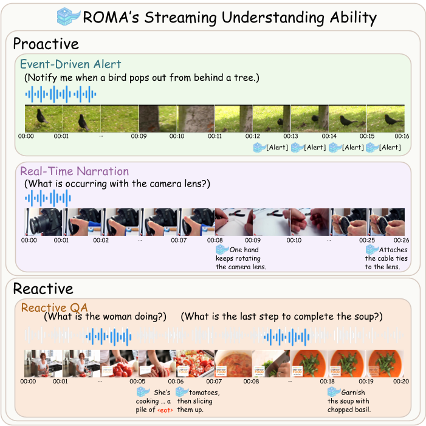

# ROMA: Real-time Omni-Multimodal Assistant with Interactive Streaming Understanding

<p align="center">
  <a href="https://arxiv.org/abs/2601.10323">📄 Paper</a> •
  <a href="https://eureka-maggie.github.io/ROMA_show/">🌐 Project Page</a> •
  <a href="https://huggingface.co/EurekaTian/ROMA">🤗 Model</a> •
  <a href="https://huggingface.co/datasets/EurekaTian/ROMA_proactive">📊 Dataset</a>
</p>

---

## 🔥 Teaser

<p align="center">

</p>

> **Figure placeholder**  
> Replace with the teaser figure from the paper.

---

## 📖 Introduction

**ROMA** is a **real-time omni-multimodal assistant** for unified **streaming audio-video understanding**.

Unlike traditional VideoLLMs that only respond to explicit queries, ROMA supports both:

- **Reactive interaction** (question answering)
- **Proactive interaction** (event alerts and narration)

ROMA processes continuous streams as **synchronized multimodal units**, aligning dense audio signals with discrete video frames.  
A lightweight **Speak Head** decouples **response timing** from **content generation**, enabling the model to autonomously decide **when to speak** in streaming environments.

The model is trained with a **two-stage streaming curriculum** and evaluated on a **unified benchmark suite covering 12 streaming tasks**.

---

## 🚀 Highlights

- **Unified Reactive + Proactive Streaming Interaction**
- **Streaming Audio-Video Understanding**
- **Lightweight Speak Head for Response Timing**
- **Two-Stage Streaming Curriculum Training**
- **Evaluation Across 12 Benchmarks**

---

## 📊 Performance

ROMA achieves **state-of-the-art performance on proactive streaming tasks** while remaining competitive on traditional reactive QA benchmarks.

| Model | Proactive Alert | Real-Time Narration | Reactive QA |
|------|----------------|--------------------|------------|
| VideoLLM-Online | baseline | baseline | baseline |
| MiniCPM-o-2.6 | competitive | competitive | strong |
| Qwen2.5-Omni | competitive | competitive | strong |
| **ROMA (Ours)** | **SOTA** | **SOTA** | **Competitive** |

> Replace this table with exact numbers from the paper tables if desired.

---

## 🧠 Model

| Model | Parameters | Modalities | Capability |
|------|-----------|-----------|-----------|
| ROMA | **11B** | Audio + Video + Text | Streaming Multimodal Understanding |

Model weights are available at:

👉 https://huggingface.co/EurekaTian/ROMA

---

## 📊 Dataset

The **ROMA Proactive Streaming Dataset** is released at:

👉 https://huggingface.co/datasets/EurekaTian/ROMA_proactive

Dataset statistics:

| Subset | Task | Samples |
|------|------|------|
| Event-Driven Alert | Proactive Monitoring | **27K** |
| Real-Time Narration | Streaming Captioning | **109K** |
| **Total** |  | **136,193** |

Source datasets include:

- DiDeMo
- OOPS
- Charades-STA
- COIN
- YouCook2
- ActivityNet

These datasets are reformulated into **streaming interaction formats** for training proactive multimodal assistants.

---

## 📂 Repository Structure

```
ROMA
├── data
│   └── test_mix_data.json        # example dataset format
├── eval                          # evaluation scripts
├── sh
│   └── train.sh                  # training entry
├── requirements.txt              # dependencies
└── README.md
```

---

## 🏋️ Training

Install dependencies:

```bash
pip install -r requirements.txt
```

Run training:

```bash
bash sh/train.sh
```

Example data format:

```bash
data/test_mix_data.json
```

---

## 📈 Evaluation

All evaluation scripts are provided in:

```bash
eval/
```

The evaluation covers:

- Proactive Alert
- Real-Time Narration
- Reactive QA

---

## 📚 Citation

If you find this work useful, please cite:

```bibtex
@article{tian2026roma,
  title={ROMA: Real-time Omni-Multimodal Assistant with Interactive Streaming Understanding},
  author={Tian, Xueyun and Li, Wei and Xu, Bingbing and Dong, Heng and Wang, Yuanzhuo and Shen, Huawei},
  journal={arXiv preprint arXiv:2601.10323},
  year={2026}
}
```

---

## ⭐ Acknowledgement

If you find this repository helpful, please consider giving it a ⭐